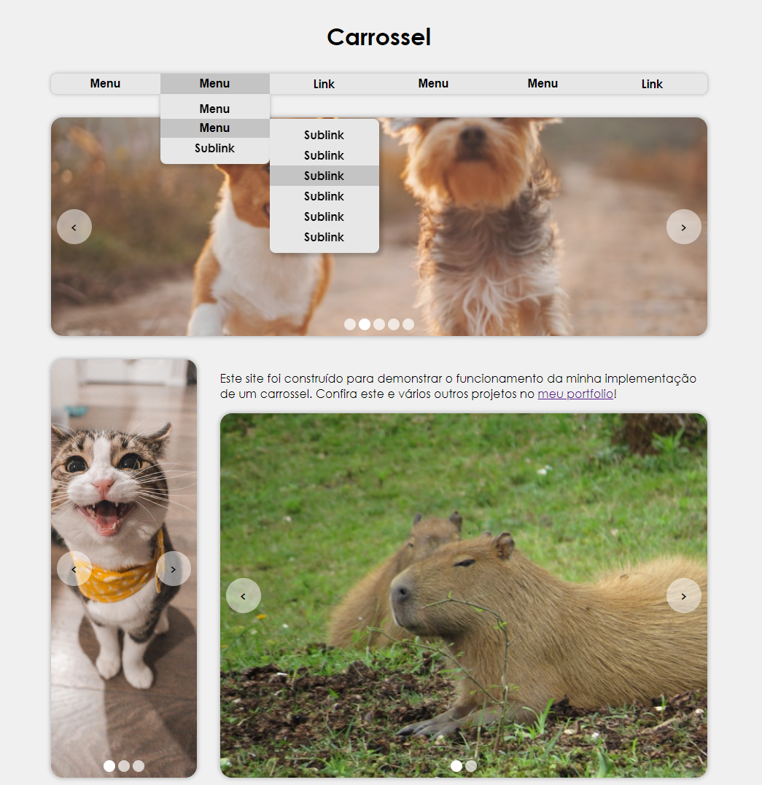

# Carrossel

Esta implementação de barra de navegação e carrossel de imagens faz parte de um exercício proposto pelo site [The Odin Project](https://www.theodinproject.com/) para prática de interfaces de usuário interativas. Confira a [página que demonstra o funcionamento do carrossel e barra de navegação](https://diego-moreira8.github.io/odin-navbar-and-carousel)!



## Funcionalidades

### Barra de navegação

- Pode ser simples, com apenas links;
- Pode ter até dois níveis de submenus;

### Carrossel

- Carrossel reutilizável: você pode criar várias instâncias com as configurações que quiser;
- Botões de navegação para avançar, voltar e pular para um slide específico;
- Slides podem ser links.

## Como usar

1. Clone o repositório:

```bash
git clone https://github.com/Diego-Moreira8/odin-carousel.git
```

2. Vá até o diretório do repositório:

```bash
cd odin-carousel
```

3. Abra o arquivo `index.html` em um servidor local, como plugin Live Server, disponível no VS Code.
